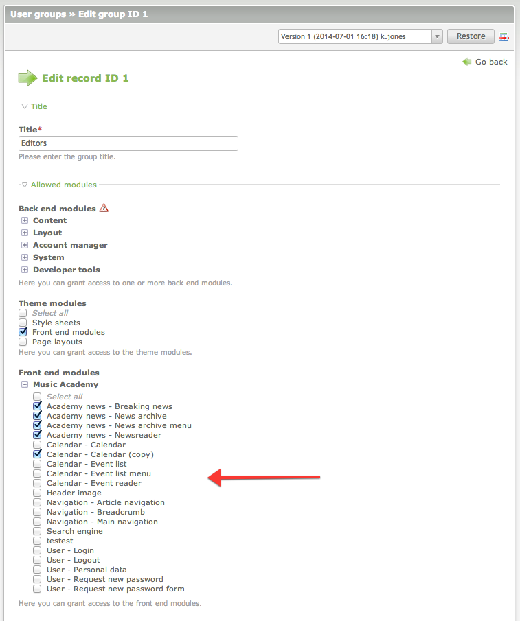

# Module Permissions extension for Contao Open Source CMS

Module Permissions is an extension for the [Contao Open Source CMS](https://contao.org).

This extension allows you to set the back end user permissions for certain front end modules. The modules can be limited 
just like the back end modules, per user group or by per each user individiually.

## Documentation

[Read the documentation](docs/README.md)

## Copyright

This project has been created and is maintained by [Codefog](https://codefog.pl).
