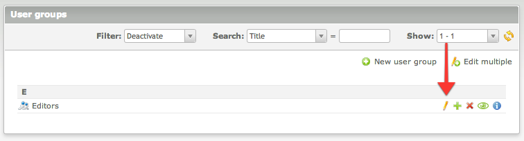
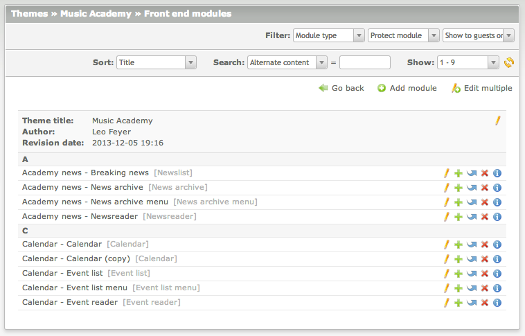

# Module Permissions – Documentation

## Permissions for user group

The front end module permissions for user group are set in the `User groups` module. Simply edit the desired record and 
choose which modules the users should be granted access to.

## Permissions for user

The front end module permissions for individual users are set in the `Users` module. 
Simply edit the desired record and choose which modules the users should be granted access to.

Once these permissions are set, the front end modules for users will be limited:

